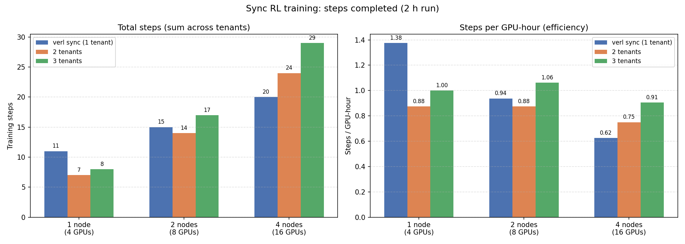
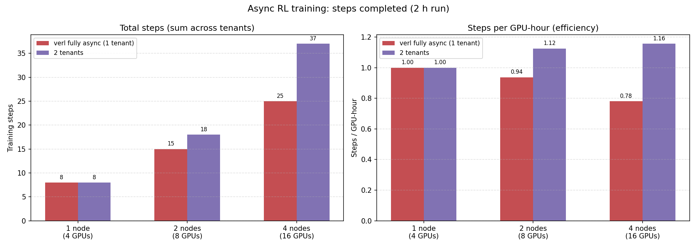

# Sharing is Scaling: Efficient RL Fine-tuning with Multi-tenancy

by Mahdi Atallah and Youssef Boughizane

## Motivation

RL has become a standard step in post-training LLMs, especially for reasoning. DeepSeek-R1 [1] and the o-series from OpenAI showed that RL with verifiable rewards can take a base model well past what SFT alone gets you, and the recipe has since been picked up across the open ecosystem. LoRA [2] has also proven to be an effective technique for parameter-efficient fine-tuning, including in the RL setting [3]. This widespread adoption raises a practical question: how do we most efficiently serve many users running their own RL LoRA fine-tuning workloads?

In synchronous RL, we alternate between rollout phases (response generation) and training phases (gradient update), where the latter cannot begin until all responses in the batch are complete. This method suffers from massive GPU underutilization in the rollout phase [2]. This is mainly due to the long tail distribution of response lengths in reasoning models: the majority of requests finish early, while a minority have long responses. During the long tail, most GPUs sit idle or process only a small number of remaining sequences. For a memory-bound workload like LLM decoding, this translates directly to wasted compute.

To mitigate this, several works propose asynchronous RL [4, 5, 6, 7], which decouples the rollout and training phases. Rather than waiting for all responses to finish, the trainer begins updates as soon as enough samples are available, while the rollout worker continues generating in parallel. This improves hardware utilization at the cost of on-policy training: some training samples will be generated under an older version of the model.

In this work, we look to exploit the long tail inefficiency using a multi-tenant setup. Rather than serving a single user, we train multiple LoRA adapters on a shared base model simultaneously, using the compute left idle during the long tail to issue rollouts for independent tenants in parallel and guarantee a large inference batch size. This is possible thanks to Punica [8], a multi-LoRA serving system that batches computation across adapters without duplicating base model weights.

## Experiments

We build on verl's fully-async policy implementation, which dedicates separate GPU pools to rollout and training. We extend it with multi-tenant support: each user owns a private LoRA adapter trained on top of a single shared base model. Rollouts across tenants are served in parallel through mixed batching, while training steps are executed sequentially, one tenant at a time. This choice is motivated by the fact that the rollout stage dominates runtime, accounting for roughly 70% of each training step [2].

For the rollout phase, a single vLLM engine loads the base model once and keeps all tenant adapters resident in GPU memory. Because vLLM implements Punica, requests from different tenants can be batched together in a single forward pass, each routed through its corresponding adapter.

For the training phase, a shared GPU pool operates in a time-sliced fashion: the trainer polls one queue per tenant and runs a gradient update for whichever tenant has enough samples ready, swapping LoRA adapters between steps. After each update, only that tenant's adapter weights are synced back to vLLM, and new rollout requests are dispatched. The trainer then returns to polling the queues.

Although the system is built on verl's fully-async implementation, it can be made fully synchronous by setting `trigger_parameter_sync_step=1` and `staleness_threshold=0`.

We evaluate our system across two experiments:

**Experiment 1.** Compares synchronous single-tenant training (verl's implementation) against 2- and 3-tenant runs using our multi-tenant system, to assess whether multi-tenancy can improve upon synchronous training throughput. verl's synchronous implementation is colocated: all GPUs are used for rollout, then all for training. Our multi-tenant implementation is disaggregated, with half the GPUs dedicated to rollout while the other half trains concurrently.

**Experiment 2.** Compares single-tenant asynchronous training (verl's fully async implementation) against a 2-tenant asynchronous run, to evaluate whether combining multi-tenancy with asynchrony can further improve throughput and match or exceed the state-of-the-art method in throughput (steps per GPU-hour).

Both experiments were conducted with Qwen3-4B, the GRPO algorithm [9], and the DAPO-Math-17k-Processed dataset, with LoRA rank = alpha = 32, lr = 5e-5, max response length = 32k, fsdp_group_size = 2, batch size of 32 prompts and 8 responses per prompt. The asynchronous experiments used `trigger_parameter_sync_step = 2` and `staleness_threshold = 0.1`, meaning that at each parameter sync from trainer to rollout worker, (32 × 8) × (2 + 1) = 768 requests were submitted to vLLM per tenant. Both experiments were run with 1, 2, and 4 GH200 nodes on the Clariden cluster at CSCS.

## Results

**Experiment 1.** At high node counts, multi-tenant synchronous training outperforms single-tenant synchronous training by 45% in throughput. At low node counts, single-tenant training has the edge: the KV cache becomes saturated by concurrent tenant workloads. This is consistent with findings from the literature [2]: verl's synchronous training is effective at small scale, where collocated GPUs are well utilized during rollout, but becomes inefficient at larger scales, where those GPUs are underutilized and benefit more from being decoupled from the training phase. Multi-tenant solves this by decoupling rollout from training across tenants, recovering GPU utilization at scale without sacrificing on-policy strictness.

**Experiment 2.** Multi-tenant asynchronous training consistently outperforms single-tenant asynchronous training at every scale. While single-tenant throughput per GPU-hour degrades significantly with scale, multi-tenant throughput remains stable, resulting in a growing performance gap — from parity at 1 node to 20% at 2 nodes and 48% at 4 nodes.

## Conclusion

Multi-tenancy is an additional dimension for scaling RL workloads. It can substitute asynchrony to produce cost-efficient on-policy training, or be combined with it to achieve even higher throughput. Future work includes evaluation on code datasets, where environment interaction introduces additional bubbles, as well as smarter scheduling techniques that are KV cache- and long-tail-aware to avoid KV cache capacity saturation. More broadly, this work lays the groundwork for a future Reinforcement Learning-as-a-Service platform.

## References

[1] DeepSeek-R1: Incentivizing reasoning capability in LLMs via reinforcement learning. https://arxiv.org/pdf/2501.12948

[2] RollPacker: Mitigating Long-Tail Rollouts for Fast, Synchronous RL Post-Training. https://arxiv.org/pdf/2509.21009

[3] LoRA Without Regret. https://thinkingmachines.ai/blog/lora/

[4] Magistral. https://arxiv.org/abs/2506.10910

[5] AReaL: A Large-Scale Asynchronous Reinforcement Learning System for Language Reasoning. https://arxiv.org/abs/2505.24298

[6] StreamRL: Scalable, Heterogeneous, and Elastic RL for LLMs with Disaggregated Stream Generation. https://arxiv.org/abs/2504.15930

[7] AsyncFlow: An Asynchronous Streaming RL Framework for Efficient LLM Post-Training. https://arxiv.org/abs/2507.01663

[8] Punica: Multi-tenant LoRA serving. https://arxiv.org/pdf/2310.18547

[9] DeepSeekMath: Pushing the Limits of Mathematical Reasoning in Open Language Models. https://arxiv.org/abs/2402.03300
